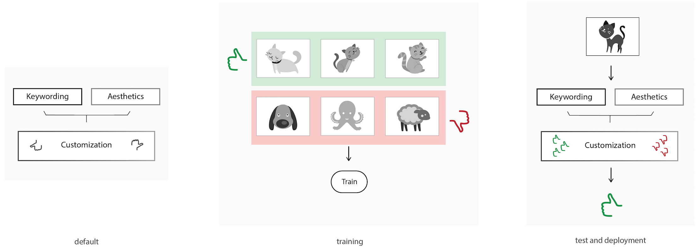

Customized Training
=================================

In order to use the customisation module for adding keywords and/or styles, it needs to be trained with handpicked data.

The steps required for training are:

* add images
* assign images as positives or negatives to custom model
* run training
* repeat training for fine-tuning in order to improve results
* test trained customisation module using the predict function

Adding images
-------------

To add image to SDK, you can send a POST request to the following endpoint:
::

  curl 127.0.0.1:5000/custom/add?image_id=<image_id> -X POST -F "data=@./your_img.jpg"
  
where image_id is an optional argument. Without this argument, the system will generate a random ID number and return it as a response.

In python:
::

  def add_image(img, image_id=None):
      with open(img,'rb') as image:
          data = {'data': image}
          url = 'http://127.0.0.1:5000/custom/add'
          if image_id:
              url += '?image_id=' + image_id
          r = requests.post(url, files=data).json()
      return r

Assigning images
----------------

To assign added image to custom model, send a GET request to the same endpoint:
::

  curl 127.0.0.1:5000/custom/assign/<image_id>/<type>/<tag>

where image_id is ID that you got (or specified) on previous step, type is type of the sample (can be only either 'positive' or 'negative') and tag is name of the custom tag.

In python:
::

  def assign_image(sample_type, tag, image_id):
      url = 'http://127.0.0.1:5000/custom/assign/%s/%s/%s'%(image_id, sample_type, tag)
      r = requests.get(url).json()
      return r

Training
------------

To run training, you can send a GET request to the following endpoint:
::

  curl 127.0.0.1:5000/custom/train/<tag>

The following request will return a json file with field task_id that can be used to get status of training:
::

  curl 127.0.0.1:5000/status/<task_id>
  

Resetting a model
------------

To reset a model, you can send a GET request to the following endpoint:
::

  curl 127.0.0.1:5000/custom/delete/<tag>

Prediction from Images
-----------------------

Custom model only
^^^^^^^^^^^^^^^^^^^^^^^^

To get the prediction of a custom model with the name 'tag', you can call the following endpoint:
::

  curl 127.0.0.1:5000/predict/custom/<tag> -X POST -F "data=@./your_img.jpg"

In python:
::

  def get_custom_predictions(img, tag):
     with open(img,'rb') as image:
         data = {'data': image}
         pred = requests.post('http://127.0.0.1:5000/predict/custom/%s'%tag, files=data).json()
     return pred

All custom models
^^^^^^^^^^^^^^^^^^

You can also get predictions for **all** custom models by calling the endpoint:
::

  curl 127.0.0.1:5000/predict/custom -X POST -F "data=@./your_img.jpg"

In python:
::

  def get_custom_predictions(img):
     with open(img,'rb') as image:
         data = {'data': image}
         pred = requests.post('http://127.0.0.1:5000/predict/custom', files=data).json()
     return pred

All models
^^^^^^^^^^

Lastly, you can use the general endpoint to get a prediction for all custom models, as well as the base models:
::

  curl 127.0.0.1:5000/predict -X POST -F "data=@./your_img.jpg"

In python:
::

  def get_predictions(img):
     with open(img,'rb') as image:
         data = {'data': image}
         pred = requests.post('http://127.0.0.1:5000/predict', files=data).json()
     return pred

Prediction on added image
--------------------------

To get custom models predictions for added image, send a GET request to the following endpoint:
::

  curl 127.0.0.1:5000/custom/predict/<image_id>

Or you can get prediction one for one custom model:
::

  curl 127.0.0.1:5000/custom/predict/<tag>/<image_id>

In python:
::

  def get_predictions_added(image_id, tag=None):
      if tag is None:
          pred = requests.get('http://127.0.0.1:5000/custom/predict/%s'%(image_id)).json()
      else:
          pred = requests.get('http://127.0.0.1:5000/custom/predict/%s/%s'%(tag, image_id)).json()
      return pred

Load a pretrained custom Model
------------------------------

You can load a pretrained custom model by calling the following endpoint:
::

  curl 127.0.0.1:5000/set_state -X POST -F "data=@./state.tar"
